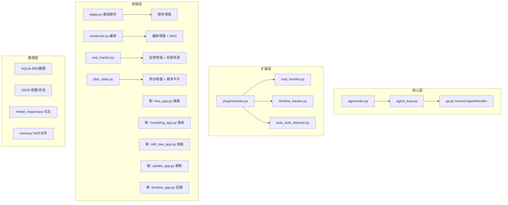

## 产品概述

为 GenericAgent 项目添加 9 项功能，增强其作为自主 Agent 框架的完整性。每项功能独立开发，通过 git commit 记录每次修改。

## 核心功能

### 需扩展的现有模块（5项）

1. **聊天增强** — 在现有前端（stapp.py/tui_v3.py）基础上添加图片粘贴（base64编码传入）、会话历史管理（基于 session_names.py 扩展）
2. **编排增强** — 扩展 conductor.py，添加 DAG 依赖调度（子任务间前置依赖）、编排模板（常用工作流模板化）
3. **监控增强** — 扩展 cost_tracker.py，添加 psutil 系统资源监控（CPU/内存/磁盘）、前端仪表盘
4. **待办增强** — 扩展 plan_state.py，添加悬浮任务卡片 UI、从对话自动识别意图生成待办项
5. **回溯系统** — 基于 model_responses/ 日志和 session_names.py，添加时间线可视化、分支 Fork（从历史点开新分支）、多时间线切换

### 需新建的模块（4项）

6. **蜂巢系统** — 基于 assets/agent_bbs.py 构建蜂巢管理前端，支持目标发布、Worker 注册、任务领取、结果验收的完整 BBS 协作流程
7. **吸收系统** — 基于 morphling_sop.md 构建 Morphling 管理界面，支持目标项目分析、组件分解、测例管理、吸收进度跟踪
8. **技能系统** — 技能树可视化（读取 memory/ 下 SOP 文件构建树状结构）+ SOP 在线编辑器（语法高亮、实时预览）
9. **更新系统** — 版本检测（git remote 对比）、差异对比、一键 git pull 更新、冲突自动合并策略

## 技术栈

### 核心技术

- **语言**: Python 3.10+
- **后端框架**: FastAPI（conductor.py, agent_bbs.py 已用）
- **前端框架**: Streamlit（主前端 stapp.py）+ 纯 HTML/JS（conductor.html 模式）
- **数据存储**: SQLite（BBS 已用）+ JSON 文件（配置/状态）
- **实时通信**: WebSocket（conductor.py 已用）
- **系统监控**: psutil（需新增依赖）

### 实现方案

#### 模块划分策略

采用**插件化模块**设计，每个功能作为独立模块放入 `frontends/` 目录，通过统一入口启动。核心逻辑通过 hooks.py 事件系统集成，UI 层独立。

#### 技术架构



#### 关键技术决策

1. **图片粘贴**: 前端 base64 编码 → 通过 `put_task(images=[...])` 传入 → LLM 多模态 API
2. **DAG 依赖调度**: conductor.py 中扩展 SubAgentState 添加 `depends_on` 字段，conductor_loop 检查依赖完成后才启动
3. **系统资源监控**: psutil 定时采集 → 队列传递 → 前端图表渲染（Streamlit chart 或 HTML Canvas）
4. **对话回溯时间线**: 解析 model_responses/*.txt 的 `=== Prompt/Response ===` 块构建时间线树，支持从任意节点 Fork
5. **蜂巢前端**: 基于 agent_bbs.py 的 API 构建管理界面，复用其 SQLite 存储
6. **技能树**: 递归扫描 memory/ 目录 → 解析 SOP 文件标题 → 构建树状 JSON → 前端渲染
7. **更新检测**: `git remote update` + `git rev-list HEAD..@{u}` 对比 → `git pull --rebase` 合并

### 执行顺序（依赖关系）

```
1. 监控增强（独立，无依赖）
2. 聊天增强（独立，扩展现有前端）
3. 编排增强（独立，扩展 conductor.py）
4. 待办增强（独立，扩展 plan_state.py）
5. 回溯系统（独立，解析日志文件）
6. 蜂巢系统（独立，基于 agent_bbs.py）
7. 吸收系统（依赖蜂巢系统完成后的 API）
8. 技能系统（独立，读取 memory/ 目录）
9. 更新系统（独立，git 操作）
```

## Agent Extensions

### Skill: writing-plans

- **Purpose**: 在实现每个功能模块前，先编写详细的实施计划
- **Expected outcome**: 每个功能模块有清晰的实施步骤和验收标准

### Skill: verification-before-completion

- **Purpose**: 每个功能完成后进行验证，确保功能正常工作
- **Expected outcome**: 通过测试验证功能完整性，提交 git commit

### Skill: dispatching-parallel-agents

- **Purpose**: 对于无依赖关系的功能模块（如监控、聊天、编排、待办），可以并行开发
- **Expected outcome**: 多个独立功能同时推进，提高开发效率

### SubAgent: code-explorer

- **Purpose**: 在实现每个功能前，深入探索相关代码文件，确保修改方案与现有架构一致
- **Expected outcome**: 准确定位修改目标，避免引入不兼容的代码模式